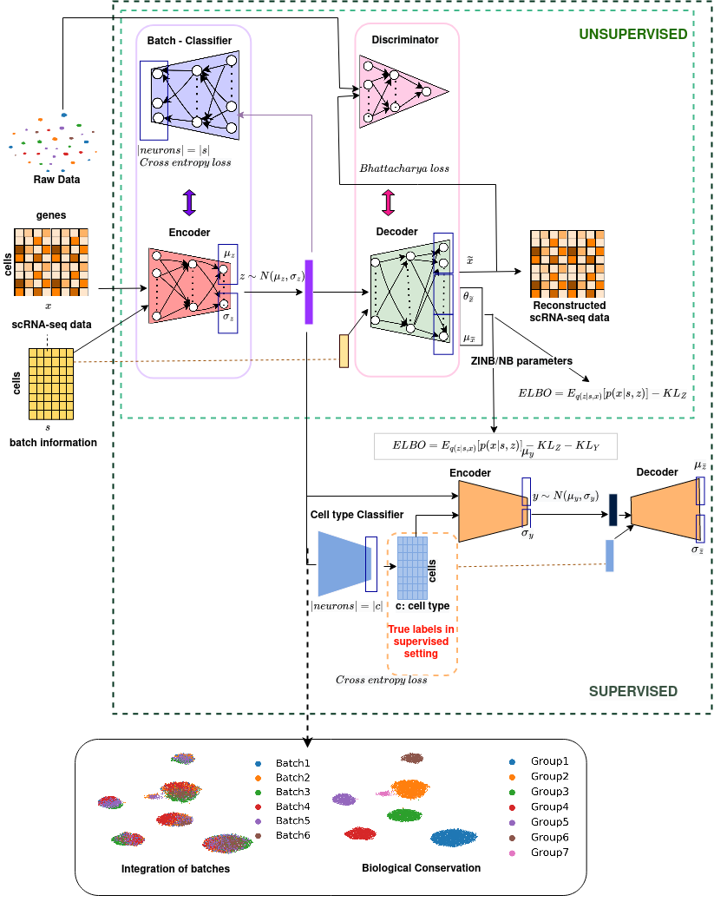

# scDREAMER
## Overview
**scDREAMER** is a single-cell data integration framework that employs a novel adversarial variational autoencoder for learning lower-dimensional cellular embeddings and a batch classifier neural network for the removal of batch effects. See our preprint below for more details. 

## Installation

A stable `pip` installation release for scDREAMER package will be made available shortly. For now, we recommend users to directly clone our stable `main` branch and set `scDREAMER` as the working directory. Creating conda environment using ./ENVIRONMENTS/scDREAMER.yml will install all the dependent packages and libraries. scDREAMER can be set up as follows 

1. git clone https://github.com/Zafar-Lab/scDREAMER.git
2. conda env create -f scDREAMER.yml

## What Computational tasks can scDREAMER be used for?

`scDREAMER` suite can be used for:
1. scDREAMER for an unsupervised integration of multiple batches
2. scDREAMER-SUP for a supervised integration across multiple batches
3. scDREAMER-SUP can also be when cell type annotations are missing in the datasets i.e., 10%, 20%, 50%
4. Atlas level and cross-species integration
5. Large datasets with ~1 million cells

## Tutorials
Check out the following Colab notebook to get a flavor of a typical workflow for data integration using scDREAMER and scDREAMER-SUP ([Link to Datasets](https://drive.google.com/drive/folders/1alw75wwWRg9KXopUccPhMh6N3b6dOoE9?usp=sharing)):

1. [scDREAMER applied to lung atlas integration task](https://colab.research.google.com/drive/10wWVPVeWgHfZL_B8_fRzRIDE1wUq2NvO?usp=sharing) 
2. [scDREMER-SUP applied to human immune cells integration task](https://colab.research.google.com/drive/1t9g7dLKeHfYbPXpTygO1DuXwWV4sJlSB?usp=sharing)
3. [scDREAMER-SUP applied to human immune cells integration task under 50% missing cell labels setting](https://colab.research.google.com/drive/11DMVjIzx53xt6FBiv8l1YGFl-fVUoJGT?usp=sharing)

## Contributing
In case of any bug reports, enhancement requests, general questions, and other contributions, please create an issue. For more substantial contributions, please fork this repo, push your changes to your fork, and submit a pull request with a good commit message.

## Cite this article
Ajita Shree*, Musale Krushna Pavan*, Hamim Zafar. scDREAMER: atlas-level integration of single-cell datasets using deep generative model paired with adversarial classifier. bioRxiv 2022.07.12.499846; doi: https://doi.org/10.1101/2022.07.12.499846  
* equally contributed
